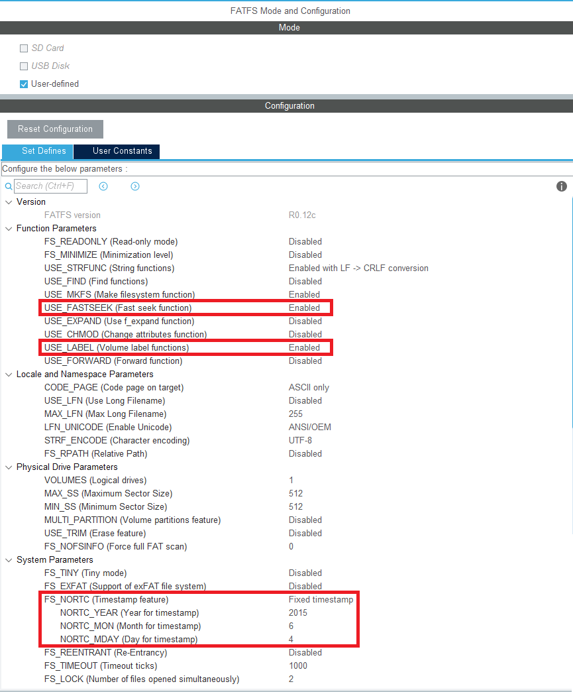

# MSCDFU
A Device Firmware Upgrade bootloader via USB Mass Storage Class.  
Only tested on STM32H7 and STM32F4.  
But it should works fine on any MCU which has USB interface.

---

## Contents

1. Dependencies
2. CubeMX Configuration
3. Source Code Modification
    1. usbd_storage_if.c
    2. user_diskio.c
    3. fatfs.c
    4. fatfs.h
    5. main.c
4. Guide of the System
5. Done Check List

---

### 1. Dependencies

| Part | Requires |
| ---- | -------- |
| Hardware | STM32F411CEU6 |
| IDE | STM32CubeIDE v1.15.1 |
| FW Package | STM32Cube FW_F4 V1.28.0 |

---

### 2. CubeMX Configuration

The below IP configurations only show the setting which make it can communication to a computer, the others IP(Power, RCC, ...) still need to be configuratured before generate code.

The USB_OTG_FS operating mode is set to __Device_Only__, and the configurations are default.


The USB_Device operating mode is set to __Mass Storage Class__, and the configurations are also default.


The FATFS is a middleware in this MCU, the operating mode is set to __User-defined__. There some modifies in the configuration:  

a. __USE_FASTSEEK__ isn't use, can be disable.  
b. __USE_LABEL__ will be use, should be set to enable.  
c. __FS_NORTC__ is optional, using RTC can record date and time while create or modify a file. So far, MSCDFU is just run on SRAM, the real time isn't necessary. So, set it to fixed timestamp and give it a default date.


There are some user constants need to be define.


---

### 3. Source Code Modification

1. usbd_storage_if.c  
```C
/** @defgroup USBD_STORAGE_Private_Defines
  * @brief Private defines.
  * @{
  */

#define STORAGE_LUN_NBR                  1
// STORAGE_BLK_NBR = (Internal RAM - MSCDFU usage) / STORAGE_BLK_SIZ
#define STORAGE_BLK_NBR                  0xF0
#define STORAGE_BLK_SIZ                  0x200
```
```C
int8_t STORAGE_Read_FS(uint8_t lun, uint8_t *buf, uint32_t blk_addr, uint16_t blk_len)
{
  /* USER CODE BEGIN 6 */
  memcpy(buf,(uint8_t*)(DISK_ADDRESS+blk_addr*STORAGE_BLK_SIZ),(blk_len*STORAGE_BLK_SIZ));


  UNUSED(lun);
  UNUSED(buf);
  UNUSED(blk_addr);
  UNUSED(blk_len);

  return (USBD_OK);
  /* USER CODE END 6 */
}
```
```C
int8_t STORAGE_Write_FS(uint8_t lun, uint8_t *buf, uint32_t blk_addr, uint16_t blk_len)
{
  /* USER CODE BEGIN 7 */
  memcpy((uint8_t*)(DISK_ADDRESS+blk_addr*STORAGE_BLK_SIZ),buf,(blk_len*STORAGE_BLK_SIZ));


  UNUSED(lun);
  UNUSED(buf);
  UNUSED(blk_addr);
  UNUSED(blk_len);

  return (USBD_OK);
  /* USER CODE END 7 */
}
```

2. user_diskio.c
```C
DSTATUS USER_initialize (
	BYTE pdrv           /* Physical drive nmuber to identify the drive */
)
{
  /* USER CODE BEGIN INIT */
  Stat = STA_NOINIT;
  Stat&=!STA_NOINIT;
  return Stat;
  /* USER CODE END INIT */
}
```
```C
DSTATUS USER_status (
	BYTE pdrv       /* Physical drive number to identify the drive */
)
{
  /* USER CODE BEGIN STATUS */
  return Stat;
  /* USER CODE END STATUS */
}
```
```C
DRESULT USER_read (
	BYTE pdrv,      /* Physical drive nmuber to identify the drive */
	BYTE *buff,     /* Data buffer to store read data */
	DWORD sector,   /* Sector address in LBA */
	UINT count      /* Number of sectors to read */
)
{
  /* USER CODE BEGIN READ */
  uint32_t *pSrcBuffer  =(uint32_t*)buff;
  uint32_t *pSramAddress=(uint32_t*)(DISK_ADDRESS+(sector*BLOCK_SIZE));
  uint32_t BufferSize   =(BLOCK_SIZE*count);

  memcpy(pSrcBuffer,pSramAddress,BufferSize);

  return RES_OK;
  /* USER CODE END READ */
}
```
```C
DRESULT USER_write (
	BYTE pdrv,          /* Physical drive nmuber to identify the drive */
	const BYTE *buff,   /* Data to be written */
	DWORD sector,       /* Sector address in LBA */
	UINT count          /* Number of sectors to write */
)
{
  /* USER CODE BEGIN WRITE */
  /* USER CODE HERE */
  uint32_t *pSramAddress=(uint32_t*)(DISK_ADDRESS+(sector*BLOCK_SIZE));
  uint32_t *pSrcBuffer  =(uint32_t*)buff;
  uint32_t BufferSize   =(BLOCK_SIZE*count);

  memcpy(pSramAddress,pSrcBuffer,BufferSize);

  return RES_OK;
  /* USER CODE END WRITE */
}
```
```C
DRESULT USER_ioctl (
	BYTE pdrv,      /* Physical drive nmuber (0..) */
	BYTE cmd,       /* Control code */
	void *buff      /* Buffer to send/receive control data */
)
{
  /* USER CODE BEGIN IOCTL */
  DRESULT res = RES_ERROR;

  if(Stat&STA_NOINIT) return(RES_NOTRDY);

  switch(cmd){
    case CTRL_SYNC:
      res=RES_OK;
    break;

    case GET_SECTOR_COUNT:
      *(DWORD*)buff=DISK_SIZE/BLOCK_SIZE;
      res=RES_OK;
    break;

    case GET_SECTOR_SIZE:
      *(DWORD*)buff=BLOCK_SIZE;
      res=RES_OK;
    break;

    case GET_BLOCK_SIZE:
      *(DWORD*)buff=1;
      res=RES_OK;
    break;

    default:
      res=RES_PARERR;
  }

  return res;
  /* USER CODE END IOCTL */
}
```

3. fatfs.c
```C
/* USER CODE BEGIN Variables */


typedef enum{
  FS_APPLICATION_IDLE,
  FS_APPLICATION_INIT,
  FS_APPLICATION_RUNNING,
  FS_APPLICATION_UPGRADE,
}FS_FileOperationsTypeDef;

FS_FileOperationsTypeDef file_operation_state=FS_APPLICATION_IDLE;
TCHAR IDENTIFY_NAME[11]={'L','I','C','E','N','S','E','.','T','X','T'};
TCHAR APP_NAME[11];
uint32_t app_last_time;


/* USER CODE END Variables */
```
```C
void MX_FATFS_Init(void)
{
  /*## FatFS: Link the USER driver ###########################*/
  retUSER = FATFS_LinkDriver(&USER_Driver, USERPath);

  /* USER CODE BEGIN Init */
  /* additional user code for init */


  if(!retUSER){
    file_operation_state=FS_APPLICATION_INIT;
  }


  /* USER CODE END Init */
}
```
```C
/* USER CODE BEGIN Application */


void getParameterStr(FIL* fp,TCHAR* str_return,TCHAR* index,int length){
  TCHAR str_tmp[100];

  f_lseek(fp,0);
  while(!f_eof(fp)){
    f_gets((TCHAR*)str_tmp,sizeof(str_tmp),fp);
    if(!strncmp(str_tmp,index,length)){
      strncpy(str_return,&str_tmp[length+1],11);
    }
  }
}

uint32_t getParameterInt(FIL* fp,TCHAR* index,int length){
  TCHAR str_tmp[11];

  getParameterStr(fp,str_tmp,index,length);
  return(strtoul(str_tmp,NULL,0));
}

int FS_Initialize(void){
  int ret=1;

  /* Register the file system object to the FatFs module */
  if(f_mount(&USERFatFS,(TCHAR const*)USERPath,0)==FR_OK){
    f_setlabel(DISK_NAME);
    /* Create and Open a new text file object with write access */
    if(f_open(&USERFile,FILENAME_CONFIG,(FA_CREATE_ALWAYS|FA_WRITE))==FR_OK){
      /* Write data to the text file */
      f_printf(&USERFile,"MSCDFU_VERSION:v%d.%d\n",MSCDFU_VERSION,0);
      f_printf(&USERFile,"MSCDFU_DATE:%08d\n",MSCDFU_DATE);
      f_printf(&USERFile,"ADDRESS_CMD:%08X\n",ADDRESS_CMD);
      f_printf(&USERFile,"ADDRESS_APP:%08X\n",ADDRESS_APP);
      f_printf(&USERFile,"APP_MASK:%08X\n","0x2FFE0000");
      f_printf(&USERFile,"APP_CHECK:%08X\n","0x20000000");
      f_printf(&USERFile,"DEVICE_UID:%08X%08X%08X\n",(*(uint32_t*)(UID_BASE  )),(*(uint32_t*)(UID_BASE+4)),(*(uint32_t*)(UID_BASE+8)));
      f_printf(&USERFile,"APP_FILENAME:%s\n",FILENAME_APP);
      /* Close the open text file */
      f_close(&USERFile);
      ret=0;
    }
  }
  FATFS_UnLinkDriver(USERPath);
  return(ret);
}

int FS_Synchronize(void){
  FILINFO  fno;
  TCHAR    read_string[11];
  uint32_t data_tmp;
  uint32_t data_mask;
  uint32_t data_check;
  int      ret=1;

  if(!FATFS_LinkDriver(&USER_Driver,USERPath)){
    if(f_mount(&USERFatFS,(TCHAR const*)USERPath,0)==FR_OK){

      if(f_stat(FILENAME_CONFIG,&fno)==FR_OK){
        if(f_open(&USERFile,FILENAME_CONFIG,(FA_READ))==FR_OK){
		  data_mask=getParameterInt(&USERFile,"APP_MASK",8);
		  data_check=getParameterInt(&USERFile,"APP_CHECK",9);
		  getParameterStr(&USERFile,APP_NAME,"APP_FILENAME",12);
        }
      }

      if(f_stat(APP_NAME,&fno)==FR_OK){
    	if(f_open(&USERFile,APP_NAME,(FA_READ))==FR_OK){
		  UINT byteread;
		  f_read(&USERFile,&data_tmp,sizeof(data_tmp),&byteread);
		  if((data_tmp&data_mask)==data_check){
		    ret=0;
		  }
		  f_close(&USERFile);
        }
      }

      if(f_stat(IDENTIFY_NAME,&fno)==FR_OK){
    	if(f_open(&USERFile,IDENTIFY_NAME,(FA_READ))==FR_OK){
    	  uint32_t buffer[8];
    	  char str_tmp[100];

    	  f_lseek(&USERFile,0);
    	  while(!f_eof(&USERFile)){
    		f_gets((TCHAR*)str_tmp,sizeof(str_tmp),&USERFile);
    		if(!strncmp(str_tmp,"UID",3)){
			  strncpy(read_string,&str_tmp[4],8);
			  buffer[0]=~strtoul(read_string,NULL,16);
    		  strncpy(read_string,&str_tmp[12],8);
    		  buffer[1]=~strtoul(read_string,NULL,16);
    		  strncpy(read_string,&str_tmp[20],8);
    		  buffer[2]=~strtoul(read_string,NULL,16);
    		  buffer[3]=0x00C0FFEE;
    		}
    	  }
    	  f_close(&USERFile);
    	  // write identify code
    	  HAL_FLASH_Unlock();
    	  HAL_FLASH_Program(FLASH_TYPEPROGRAM_WORD,ADDRESS_IDENTIFY   ,buffer[0]);
    	  HAL_FLASH_Program(FLASH_TYPEPROGRAM_WORD,ADDRESS_IDENTIFY+4 ,buffer[1]);
    	  HAL_FLASH_Program(FLASH_TYPEPROGRAM_WORD,ADDRESS_IDENTIFY+8 ,buffer[2]);
    	  HAL_FLASH_Program(FLASH_TYPEPROGRAM_WORD,ADDRESS_IDENTIFY+12,buffer[3]);
    	  HAL_FLASH_Lock();
    	}
    	// delete FILENAME_IDENTIFY to avoid flash write infinite loop
    	f_unlink(IDENTIFY_NAME);
    	NVIC_SystemReset();
      }

    }
  }
  FATFS_UnLinkDriver(USERPath);
  return(ret);
}

int FS_FirmwareUpgrade(void){
  int     ret=1;
  UINT    byteread;
  uint8_t buffer[4];

  if(!FATFS_LinkDriver(&USER_Driver,USERPath)){
    if(f_mount(&USERFatFS,(TCHAR const*)USERPath,0)==FR_OK){

      f_open(&USERFile,APP_NAME,(FA_READ));

      HAL_FLASH_Unlock();
      FLASH_Erase_Sector(4,FLASH_VOLTAGE_RANGE_3);
      FLASH_Erase_Sector(5,FLASH_VOLTAGE_RANGE_3);
      FLASH_Erase_Sector(6,FLASH_VOLTAGE_RANGE_3);
      FLASH_Erase_Sector(7,FLASH_VOLTAGE_RANGE_3);

      for(uint32_t i=0;i<(DISK_SIZE/4);i++){
				f_read(&USERFile,&buffer[0],sizeof(buffer),&byteread);
				HAL_FLASH_Program(FLASH_TYPEPROGRAM_WORD,(ADDRESS_APP+i*4),*(uint32_t*)&buffer);
      }
      memset(buffer,0x00,4);
      HAL_FLASH_Program(FLASH_TYPEPROGRAM_WORD,ADDRESS_CMD,*(uint32_t*)&buffer);
      HAL_FLASH_Lock();

      f_close(&USERFile);
      ret=0;
    }
  }
  FATFS_UnLinkDriver(USERPath);
  return(ret);
}

void MX_FATFS_Process(void){
  uint8_t workBuffer[_MAX_SS];

  /* Mass Storage Application State Machine */
  switch(file_operation_state){
    case FS_APPLICATION_INIT:
      if(f_mkfs(USERPath,FM_ANY,0,workBuffer,sizeof(workBuffer))==FR_OK){
		if(!FS_Initialize()){
		  app_last_time=HAL_GetTick();
		  file_operation_state=FS_APPLICATION_RUNNING;
		}
      }
    break;

    case FS_APPLICATION_RUNNING:
      if((HAL_GetTick()-app_last_time)>1000){
		app_last_time=HAL_GetTick();
		if(!FS_Synchronize()){
		  file_operation_state=FS_APPLICATION_UPGRADE;
		}
      }
    break;

    case FS_APPLICATION_UPGRADE:
      if(!FS_FirmwareUpgrade()){
    	file_operation_state=FS_APPLICATION_IDLE;
      }
    break;

    case FS_APPLICATION_IDLE:
      NVIC_SystemReset();
    break;

    default:
    break;
  }
}


/* USER CODE END Application */
```

4. fatfs.h
```C
/* USER CODE BEGIN Includes */


#include "string.h"


/* USER CODE END Includes */
```
```C
/* USER CODE BEGIN Prototypes */


void MX_FATFS_Process(void);


/* USER CODE END Prototypes */
```

5. main.c
```C
/* USER CODE BEGIN PD */


typedef void (*pFunction)(void);


/* USER CODE END PD */
```
```C
/* USER CODE BEGIN 0 */


int Check_License(uint32_t address){
  int ret;
  // return 1 if target address was not set yet
  if((*(uint32_t*)(address  )==0xFFFFFFFF)||\
     (*(uint32_t*)(address+4)==0xFFFFFFFF)||\
	 (*(uint32_t*)(address+8)==0xFFFFFFFF)){
	ret=1;
  }
  // return 2 if target address set but not equals to identify code
  else if((*(uint32_t*)(UID_BASE  ))!=~(*(uint32_t*)(address  ))||\
		  (*(uint32_t*)(UID_BASE+4))!=~(*(uint32_t*)(address+4 ))||\
		  (*(uint32_t*)(UID_BASE+8))!=~(*(uint32_t*)(address+8))){
	ret=2;
  }
  else{
	ret=0;
  }
  return(ret);
}

void GotoApplication(uint32_t address){
  // check license before start application
  if(!Check_License(ADDRESS_IDENTIFY)){
    // goto application
    if((*(volatile uint32_t*)ADDRESS_CMD)==CMD_GOTOAPP){
      pFunction JumpToApplication=(pFunction)*(volatile uint32_t*)(address+4);

      SysTick->CTRL=0;
      SysTick->LOAD=0;
      SysTick->VAL=0;

      __set_MSP(*(volatile uint32_t*)address);
      SCB->VTOR=address;
      JumpToApplication();
      while(1){}
    }
  }
}


/* USER CODE END 0 */
```
```C
  /* USER CODE BEGIN 1 */


  GotoApplication(ADDRESS_APP);


  /* USER CODE END 1 */
```
```C
  /* Infinite loop */
  /* USER CODE BEGIN WHILE */
  while (1)
  {
    MX_FATFS_Process();
    /* USER CODE END WHILE */

    /* USER CODE BEGIN 3 */
  }
  /* USER CODE END 3 */
```

---

### 4. Guide of the System

1. Plug in to a computer. MSCDFU device should appears as a USB disk when it has no app programmed or no license code.
2. Drag & drop a executable *.BIN file into MSCDFU, it will program into app address immediately.
3. Then, drop LICENSE.TXT file into MSCDFU.
4. MSCDFU will auto execute app at next bootup.
5. To run MSCDFU bootloader after programmed, only need to erase the ADDRESS_CMD showed in the CONFIG.TXT file when the first programming. The MSCDFU USB disk should appear after reboot.
6. Change FLASH address of the application project to ADDRESS_APP where set in CONFIG.TXT file before compile.
7. To unlock the MSCDFU, here using the chip UID as the unique 96-bit code. The LICENSE.TXT file have to include "UID:xxxxxxxxxxxxxxxxxxxxxxxx".
8. Disable desplay the chip unique ID or others infornations in CONFIG.TXT can make it more difficult to be clone.

---

### 5. Done Check List

- [x] RAM disk initialize
- [x] USB Mass Storage Class
- [x] FATFS diskio
- [x] Clear register and jump to address
- [ ] Downsize RAM usage and code.
- [x] Turn the DFU CMD and ADDRESS for F4 MCU.(It is now for F411)
- [ ] Flash directly access with RAM buffer
- [ ] Increase block size from 0x200 to 0x1000.
- [x] Anti-clone system.

---
